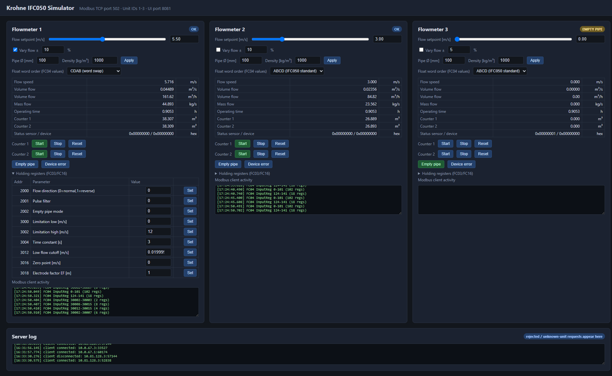
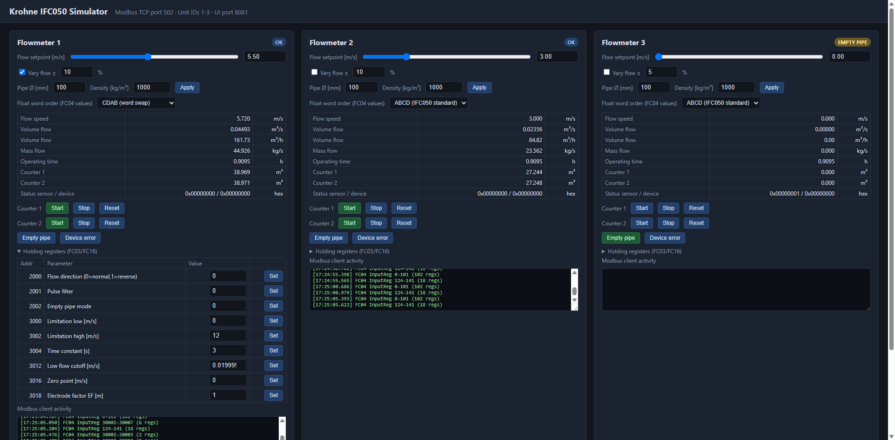
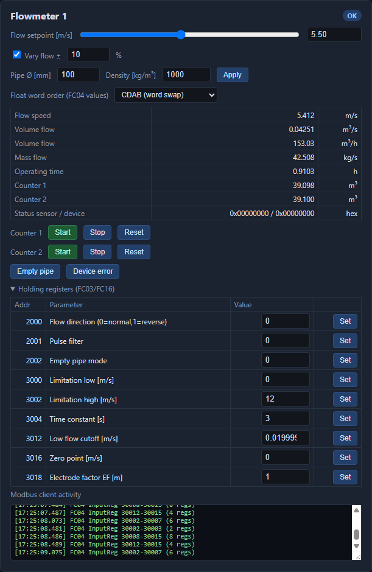

# IFC050 Flowmeter Simulator fmnkcjfm

A Node.js Modbus TCP simulator for the Krohne IFC050 electromagnetic flowmeter, with a web UI for live control. Designed for testing Modbus masters, SCADA gateways, and protocol converters without needing a physical flowmeter.

## Features

- **3 virtual flowmeters** on Modbus TCP port 502 (unit IDs 1-3)
- **Web UI** on port 8081 — dark theme, real-time updates
- **Input registers (FC04)** at 30000+: flow speed, volume flow, mass flow, operating time, counters, status
- **Holding registers (FC03/FC16)** at 42000/43000: flow direction, limitation, time constant, cutoff, zero point, electrode factor
- **Coils (FC01/FC02/FC05/FC15)**: start/stop/reset counters, empty pipe, device error
- **Float word order** permutations: ABCD, CDAB, BADC, DCBA to test endianness
- **Vary flow** ±% to simulate noisy signals
- **State persistence** across restarts (saves to `simulator-state.json`, gitignored)
- **Modbus client activity log** per meter and server-wide

## Quick Start

```bash
git clone https://github.com/jigarladhava/IFC050_Simulator.git
cd IFC050_Simulator
npm install
npm start
```

Open http://localhost:8081 in your browser. Connect your Modbus master to port 502.

### Environment Variables

| Variable | Default | Description |
|----------|---------|-------------|
| `MODBUS_PORT` | 502 | Modbus TCP server port |
| `MODBUS_HOST` | 0.0.0.0 | Modbus server bind address |
| `WEB_PORT` | 8081 | Web UI port |

## Register Map

### Input Registers (FC04) — Meter offset 30000

| Address | Field | Type | Unit |
|---------|-------|------|------|
| 30000-30001 | Flow speed | float32 | m/s |
| 30002-30003 | Volume flow | float32 | m³/s |
| 30004-30005 | Mass flow | float32 | kg/s |
| 30006-30007 | Operating time | float32 | seconds |
| 30008-30011 | Counter 1 | float64 | m³ |
| 30012-30015 | Counter 2 | float64 | m³ |
| 30016 | Status sensor | uint32 | bitmask |
| 30018 | Status device | uint32 | bitmask |

### Holding Registers (FC03) — Parameter block at 42000 / 43000

| Address | Parameter | Type |
|---------|-----------|------|
| 42000 | Flow direction | uint16 (0=normal, 1=reverse) |
| 42001 | Pulse filter | uint16 |
| 42002 | Empty pipe mode | uint16 |
| 43000-43001 | Limitation low | float32 m/s |
| 43002-43003 | Limitation high | float32 m/s |
| 43004-43005 | Time constant | float32 s |
| 43012-43013 | Low flow cutoff | float32 m/s |
| 43016-43017 | Zero point | float32 m/s |
| 43018-43019 | Electrode factor EF | float32 m |

### Coils (FC01/FC02/FC05/FC15)

| Address | Function |
|---------|----------|
| 3000 | Counter 1 run |
| 3001 | Counter 2 run |
| 3003 | Reset counter 1 (rising edge) |
| 3004 | Reset counter 2 (rising edge) |

## Screenshots

### Full overview — all 3 meters with live data and server log


### Meter cards — flow setpoints, counters, and status badges


### Flowmeter 1 with expanded holding registers


## Use Cases

- **Test Modbus masters** without a physical flowmeter
- **Validate register mapping and word order** before field deployment
- **Develop SCADA gateways** (e.g., mbdnp3c on Robustel r3000 routers)
- **Simulate alarms** (empty pipe, device error) and verify outstation behavior
- **CI/CD integration** — lightweight, no hardware dependencies

## Tech Stack

- [Node.js](https://nodejs.org) — runtime
- [Express](https://expressjs.com) — web UI server
- [modbus-tcp](https://www.npmjs.com/package/modbus-tcp) — Modbus TCP server library
- [dotenv](https://www.npmjs.com/package/dotenv) — environment configuration

## License

MIT